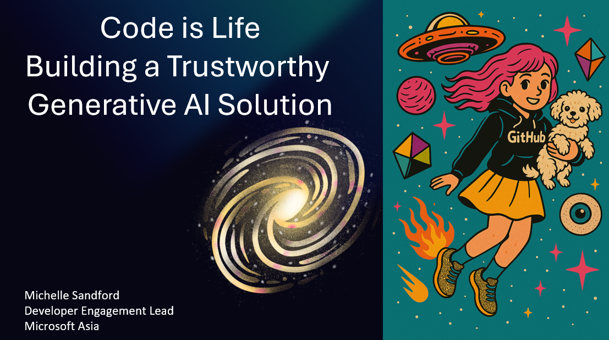

# Building Trustworthy AI

## Overview

This comprehensive guide covers 30ish essential thoughts on building trustworthy AI systems, from foundation to defence in depth. Whether you're a beginner or an experienced practitioner, you'll find valuable insights and practical guidance.

## What You'll Learn

Building trustworthy AI requires a multi-faceted approach that combines technical excellence with ethical considerations. This course covers:

### 🎯 Core Principles  
- Responsibility as foundation, not feature  
- Trust as the bedrock of AI transformation  
- Transparency and explainability by default  
- Ethical and policy alignment in practice  
- Security as core design, not perimeter defense  

### 🔧 Technical Implementation  
- Map: Identifying potential harms systematically  
- Measure: Manual and automated evaluation approaches  
- Mitigate: Defense-in-depth with Azure AI Content Safety  
- Operate: Continuous monitoring and feedback loops  
- Azure AI Foundry and GitHub workflows  

### 🌍 Real-World Practice  
- Microsoft's Responsible AI lifecycle  
- Operationalizing trust in AI agents  
- Red teaming and adversarial testing  
- Phased rollouts and incident response  
- Production-ready trustworthy AI systems  

## Course Structure

The course is organized into 6 sections (32 chapters total):  

1. **Core Concepts** – Foundations and principles of trustworthy AI (Chapters 1–10)  
2. **Map** – Identifying Harms (Chapter 11)  
3. **Measure** – Evaluation, signals, and safety (Chapters 12–21)  
4. **Mitigate** – Defenses and incident response (Chapters 22–25)  
5. **Operate** – Testing, monitoring, and continuous improvement (Chapters 26–29)  
6. **Conclusion & Resources** – Final thoughts, governance, and further learning (Chapters 30–32)  

## Key Resources

Throughout this course, you'll find links to:

- 🎓 Additional learning materials

## Prerequisites

This course is designed for:

- Software developers and engineers
- Data scientists and ML practitioners
- Product managers and technical leaders
- Anyone interested in responsible AI development

No prior AI experience is required for the introductory chapters, though programming knowledge is helpful.

## About ØREDEV 2025

ØREDEV is a premier conference bringing together developers, architects, and tech enthusiasts to explore the latest in software development, AI, and technology innovation.

---

**Ready to build trustworthy AI?** Start with [Chapter 1: Introduction to Trustworthy AI](chapters/chapter-01.md) and embark on your journey to responsible AI development.

